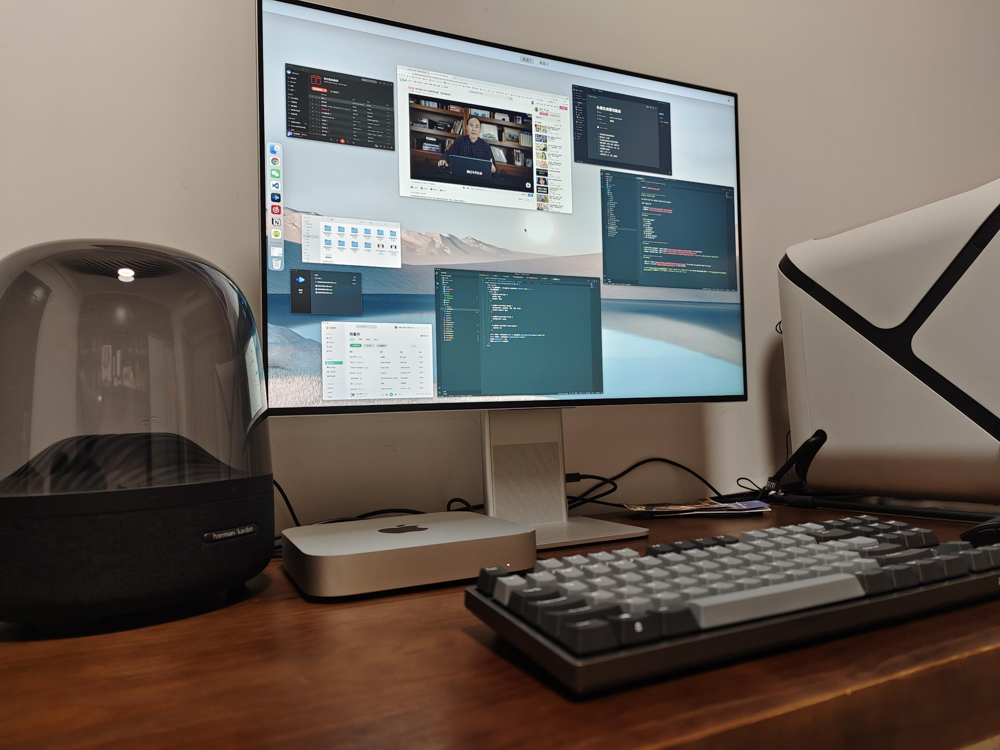

### 😉, 欢迎来到我的 GitHub 主页

我叫陈梓聪。2020 年毕业于软件工程专业后，我开始作为一名前端开发者参加工作，目前居住在东莞。

作为一名前端开发者，我特别欣赏那些别具一格的网站，并且我最大的爱好就是收集这些网站，以便于在我构思自己的作品时能带给我启发。我热爱设计，无论是在我的作品还是我的生活空间，我都会努力让它们拥有最佳的体验。

**想了解我更多，请关注我的[个人博客](https://leoku.top)**

🧑‍💻 **本周我的工作细则**
<!--START_SECTION:waka-->
```text
TypeScript   56 hrs 38 mins  █████████████████████░░░░   84.30 % 
JSON         2 hrs 38 mins   █░░░░░░░░░░░░░░░░░░░░░░░░   03.92 % 
JavaScript   2 hrs 16 mins   █░░░░░░░░░░░░░░░░░░░░░░░░   03.39 % 
SCSS         2 hrs 13 mins   ▓░░░░░░░░░░░░░░░░░░░░░░░░   03.31 % 
Vue.js       1 hr 13 mins    ▒░░░░░░░░░░░░░░░░░░░░░░░░   01.83 % 
```
<!--END_SECTION:waka-->


